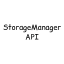

<p align="center">
  
</p>

<h1 align="center">
StorageManager API
</h1>

<p align="center">
  <a href="https://github.com/superstrellaa/StorageManager-API/releases">
    
  </a>
  
  
  <a href="https://github.com/superstrellaa/StorageManager-API/issues">
    
  </a>
  
</p>

The **StorageManager API** provides an easy way to manage persistent storage for your mods. It allows you to create, read, update, and delete structured data in an efficient, server-friendly way. By default, it uses **SQLite** as the storage backend with write-behind caching for high performance.

---

## Features

- Create, read, update, and delete data in your mods.
- Async write caching to improve performance.
- Built-in support for global and player-specific data.
- Easy-to-use API with minimal boilerplate.

---

## Important Notes

- Do **not** touch the `.internal` package. It is meant for internal use only. It also contains tags ApiStatus.Internal.
- The API is **server-side only**:
    - On client-side, the API does nothing and will only produce warnings if used.
    - Always call storage operations after the server has started.
- There is no Maven repository for this mod yet. You must manually include the JAR in your project.

---

## Installation

1. Download the **StorageManager API** JAR.
2. In your mod project (where you have `build.gradle` and `gradle.properties`), create a folder called `lib`.
3. Place the JAR inside the `lib` folder.
4. Add the following to your `build.gradle`:

``` gradle
repositories {
	flatDir {
		dirs 'lib'
	}
}

dependencies {
    modImplementation(name: "storagemanager-api-1.0.0+1.21.1")
}
```

5. Rebuild your project. The API is now ready to use.

---

## 📝 Usage Examples

### Registering Tables

``` java
StorageManager.registerTable(
    TableSchema.builder("global_data")
        .column("key", ColumnType.TEXT, true)
        .column("value", ColumnType.INTEGER)
        .primaryKey("key")
        .build()
);

StorageManager.registerTable(
    TableSchema.builder("player_data")
        .column("uuid", ColumnType.TEXT, true)
        .column("key", ColumnType.TEXT, true)
        .column("value", ColumnType.INTEGER)
        .primaryKey("uuid", "key")
        .build()
);
```

### Inserting Data

``` java
StorageManager.insert("global_data", new RowData()
    .set("key", "time")
    .set("value", 100)
);

StorageManager.insert("player_data", new RowData()
    .set("uuid", player.getUuidAsString())
    .set("key", "points")
    .set("value", 50)
);
```

### Reading Data

``` java
var rows = StorageManager.select("player_data", Map.of(
    "uuid", player.getUuidAsString(),
    "key", "points"
));

for (var row : rows) {
    int points = (Integer) row.values().get("value");
}
```

### Updating / Deleting Data

``` java
StorageManager.delete("global_data", Map.of("key", "time"));

StorageManager.insertImmediate("player_data", new RowData()
    .set("uuid", player.getUuidAsString())
    .set("key", "points")
    .set("value", 75)
);
```

### Flush Cache

``` java
StorageManager.flushAll();
```